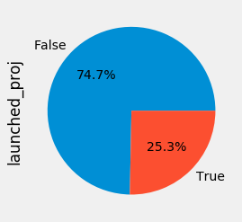
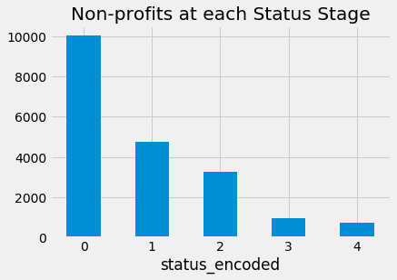
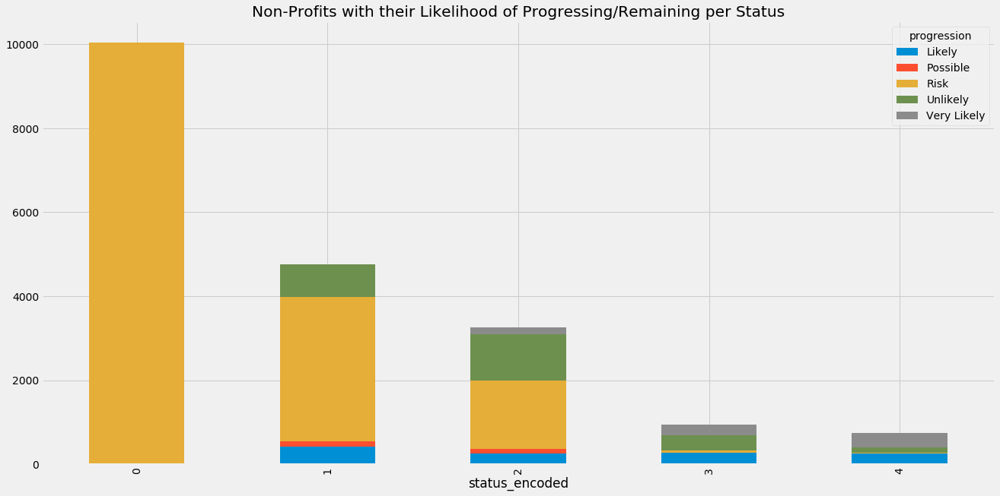

# GlobalGiving Data Challenge

<strong>Task</strong> 
Nonprofits come to GlobalGiving for many reasons, but what makes them stick around? Our program team is interested in better understanding the retention of nonprofit partners on the platform so they can better design programs to support longer-term relationships. Using the data provided, please put together a short analysis that answers the following questions:
* What metrics might we use to describe organization retention based on this data?
* How might you summarize this data such that a non-technical user could track
changes on a monthly basis? These should be static proof-of-concept examples of the kinds of things that could be included in an interactive dashboard or an automatic email report, but should not be interactive or automated for this assignment.

Immediately after looking at the descriptive statistics of the data, I could tell that organization status was a key determinant of how engaged a non-profit partner was. Higher status non-profits had higher rates of starting and deactivating projects, more field visits, and valid vetting approval dates. **These engagement values mean nothing, however, if they don't translate to funds raised on the platform (a goal for our non-profit partners, and one that denotes a healthy non-profit cohort for our donors.** 

To answer this, I looked at the average funds raised per non-profit status type. What I wanted to answer was: **Is status aligned with our goal of retention, as suggested by funds raised?**

As you can see below, this is the case:

While investigating funds raised per status, it became clear that larger organizations are not the ones necessarily raising the most money on GlobalGiving. As you can see here, some very large organizations have hardly raised any money on GG:

<i>In the future, I believe we have a big opportunity to focus on increasing the share of doantion funds for these larger organizations.</i>

## Metric Definition
I view retention in the context of GlobalGiving in two ways: 
#1 Retention for getting on the platform and successfully creating a project
#2 Retention of non-profits as they progress through the status 'funnel'

**#1 Platform Retention** 
At GlobalGiving, landing a (completing the posting of an active) campaign requires engagement on the part of the non-profit, and results in a healthy ecosystem of causes for GlobalGiving donors.   Landing a campaign is best tracked by seeing which non-profits have project deactivation dates. For the purposes of having a single KPI for **platform retention**, I will only look at project deactivation. If a project has a valid deactivation date, they were retained (in the given timeframe). If not, whether its because they never created a project or 'fell out' of the creation process, I consider them not retained.

As you can see, retention rate improves with status. I will be working on a dashboard to provide these rates per status as they change over time, and I recommend we set thresholds for each.

**#2 Retention across the 'funnel'** 
Secondly, we should look at retention across the non-profit 'funnel', meaning as non-profits progress through the increasingly important statuses. Understanding where customers are progressing, or digressing, can help identify areas where we are and are not providing guidance and the resources our non-profits need.

I'll provide a drop off rate from each status level so we can see where non-profits are digressing.

Lastly, in addition to general status progression, I calculated a likelihood of progression based on factors like vetting expiration date, active projects, last site visit, and last project landed.

This chart will be really helpful for us to understand how many non-profits per status type are on track to remain or progress, vs digress. Additionally, I'll be sending out monthly reminders for our Superstar non-profits that are at-risk of dropping. I'll be sure to include what action they have failed to take.

