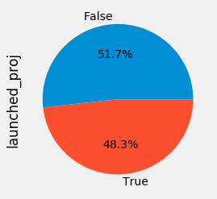

# GlobalGiving Data Challenge

<strong>Analysis</strong> 
Immediately after looking at the descriptive statistics of the data, I could tell that organization status was a key determinant of how engaged a non-profit partner was. Higher status non-profits had higher rates of starting and deactivating projects, more field visits, and valid vetting approval dates. **These engagement values mean nothing, however, if they don't translate to funds raised on the platform (a goal for our non-profit partners, and one that denotes a healthy non-profit cohort for our donors.)** 

To answer this, I looked at the average funds raised per non-profit status type. What I wanted to answer was: **Is status aligned with our goal of retention, as suggested by funds raised?**

As you can see below, this is the case: 

## Metric Definition
I view retention in the context of GlobalGiving in two ways: 
#1 Retention for getting on the platform and successfully creating a project  
#2 Retention of non-profits as they progress through the status 'funnel'

**#1 Platform Retention** 
At GlobalGiving, landing a (completing the posting of an active) campaign requires engagement on the part of the non-profit, and results in a healthy ecosystem of causes for GlobalGiving donors.   Landing a campaign is best tracked by seeing which non-profits have project deactivation dates. For the purposes of having a single KPI for **platform retention**, I will only look at project deactivation. If a project has a valid deactivation date, they were retained (in the given timeframe). If not, whether its because they never created a project or 'fell out' of the creation process, I consider them not retained.
 
**Delinquent Landed Rate** 
 

**Emerging Landed Rate** 
 

**Partner Landed Rate** 
 

**Leader Landed Rate** 
 

**Superstar Landed Rate** 
 

As you can see, retention rate improves with status. I will be working on a dashboard to provide these rates per status as they change over time, and I recommend we set thresholds for each.

**#2 Retention across the 'funnel'** 
Secondly, we should look at how non-profits progress through the status 'funnel', so we can keep a pulse on the flow of partners to the distinguished (and more funded) statuses. Understanding where customers are progressing, or digressing, can help identify areas where we are and are not providing guidance and the resources our non-profits need.

I'll provide a drop off rate from each status level so we can see where non-profits are digressing.

Lastly, in addition to general status progression, I calculated a likelihood of progression based on factors like vetting expiration date, active projects, last site visit, and last project landed.

This chart will be really helpful for us to understand how many non-profits per status type are on track to remain or progress, vs digress. Additionally, I'll be sending out monthly reminders for our Superstar non-profits that are at-risk of dropping. I'll be sure to include what action they have failed to take.

## Next Version
### Project Landed Rate  
In the future, I think it is paramount that we add in a funds raised per project threshold when considering project landed rate. All projects are not created equal, and in order to know what to optimize for, we should use funds raised per project to track which non-profits are landing **meaningful and desired** projects.
  
**Data requirements:** 
* Connect to the GlobalGiving API to get specific project funding for a non-profits active projects
  

### Finetune the Project Progression Likelihood Score  
As you'll see in my code, my equation for determining someone's likelihood of progressing is based on intuition. In my next steps, I'd love to further discuss what factors count towards someone's progression so I can update the equation accordingly, as well as how soon your team would like alerts.
  
**Data requirements:** 
* Timeframe of when status is updated
  

### Identify non-profits with large fundraising potential
While investigating funds raised per status, it became clear that larger organizations are not the ones necessarily raising the most money on GlobalGiving. As you can see here, some very large organizations have hardly raised any money on GG:

<i>In the future, I believe we have a big opportunity to focus on increasing the share of donation funds for these larger organizations.</i>
  
**Data requirements:** 
* [External dataset] - if available, integrate information on where a large non-profit is raising its funds
* Or, write a webscraper to pull in information from where these high potential organizations receieve donations
  

### Clustering of Key Attributes per Status
With our high-level retention metric in place and progression pipeline built, I would like to spend time deep-diving into the attributes of higher status non-profits. I'd approach this with a k-means clustering to start teasing out the successful attribute of our non-profits.
  
**Data requirements:** 
* I'd use the GG API to pull in additional demographic attributes like project themes, time of project posting, project region, and featured
  
